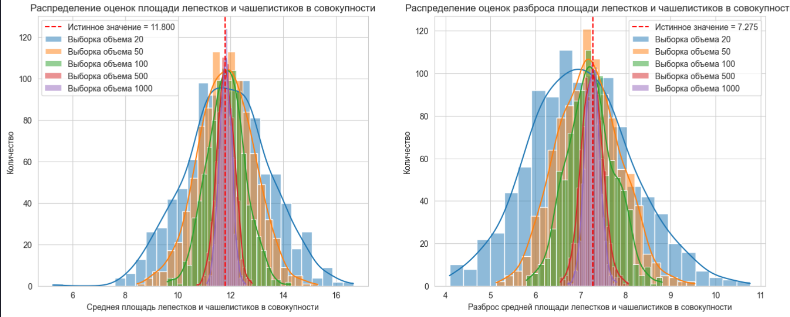

# Датасет:
В файле iris.csv представлены данные о параметрах различных экземпляров цветка ириса.

# Обработка данных:
1. Найти самое популярный и наименее популярный вид iris в датасете 
2. Посчитать статистические характеристики для суммарной площади: чашелистика, лепестка, всей совокупности и отдельно для каждого вида:
    - Выборочное среднее
    - Выборочную дисперсию
    - Выборочную медиану
    - Выборочный квантиль 2/5
3. Визуализировать данные -- построить: pdf, hist, box-plot для суммарной площади чашелистика и лепестка для всей совокупности и каждого вида

# Предположение  о распределении:
1. На основе предположенного вероятностного распределения оценить параметры данного распределения оценкой максимального правдоподобия.
Найти:
2. Теоретическое смещение
3. Дисперсию
4. MSE
5. Информацию Фишера (Если определена для данной модели)

# Эксперимент:
$P_\theta$ - предпологаемое распределение, который параметризуется вектором $\theta$, $\hat{\theta}$ - оценка параметра $\theta$, полученная при исследовании распределения.
Проведем численный эксперимент:
1. Фиксируем $\theta = \theta_0$
2. Заведем массив $\set{n_1, \dots, n_k} объемов выборки$
3. Сгенерировать из распределения $P_{\theta_0}$ достаточно большое количество $M$ выборок объема $n$, где $n$ принимает значения из массива $\set{n_1, \dots, n_m}$. Для каждой сгенерированной выбоорки вычислить оценку $\hat{\theta}$
4. Эмпирически рассмотрим поведение оценки $\hat{\theta}$ в зависимости от объема выборки
    - Вывести описательные статистики для оценок
    - Изобразить hist, box-plot, violin-plot

# Выводы
В ходе эксперимента было установлено, что данный датасет удволетворяет по каждому классу ириса нормальному закону, что было подтверждено в ходе проведения эксперимента

